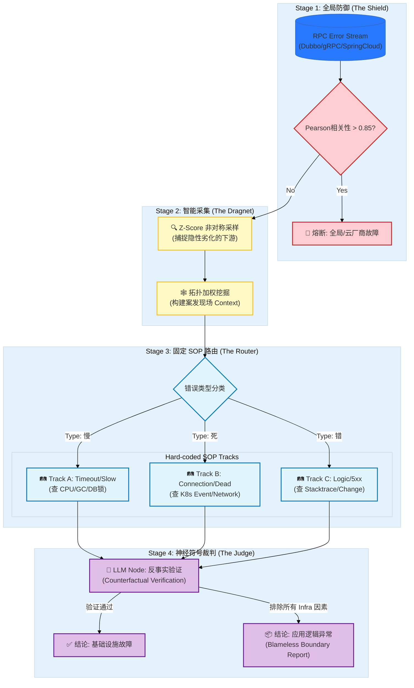

# AIOps-Intelligent-RCA v2.0: Neuro-Symbolic Triage Engine
An Agent-based Root Cause Analysis Framework with Counterfactual Verification.

> **Status:** Production-Ready | **Architecture:** Neuro-Symbolic (神经符号架构) | **Focus:** RPC Golden Signals

**AIOps-Intelligent-RCA** 是一个工业级微服务故障根因分析引擎。

与试图用 LLM 解决所有问题的“黑盒 Agent”不同，本项目采用 **Neuro-Symbolic (神经符号)** 架构：利用确定性的算法（Pearson, Z-Score）处理海量监控数据，利用确定性的 SOP（标准作业程序）固化排查路径，仅在决策链的最后一公里引入 LLM 作为 **“逻辑裁判 (Logical Judge)”**。

我们锁死 **RPC Error** 这一“黄金咽喉”，实现了对 90% 生产环境异常的 **零幻觉、高精度、自动化分诊**。

## 🚀 Key Features (核心特性)

*   **🎯 RPC-First Strategy (RPC 优先):** 收敛分析入口。基于“微服务故障必体现为 RPC 异常”的公理，实现对基础设施、中间件及代码逻辑故障的全覆盖。
*   **📐 Math over AI (算法前置):** 拒绝把原始日志直接扔给 LLM。引入 **Pearson 共模熔断** 与 **Z-Score 非对称采样**，先用数学清除 99% 的噪音。
*   **🛤️ Branching SOP Pipeline (分支型 SOP):** 摒弃不确定的 ReAct 模式，采用“慢(Slow)、死(Dead)、错(Wrong)”三条硬编码 SOP 轨道，确保排查过程绝对可控。
*   **⚖️ Counterfactual Jury (反事实陪审团):** LLM 被降级为流水线上的“质检节点”。通过“资源受害者假设”和“时序铁律”，强制否决不合逻辑的结论。

## 🏗️ Architecture (系统架构)

我们将 RCA 过程重构为 **漏斗式分诊流水线 (Triage Funnel)**，LLM 不再是驾驶员，而是传送带末端的签证官。

### 🔁 Workflow Detail

1.  **The Shield (防御):** 检测是否存在全网共模故障（如专线抖动）。若 Top N 应用错误曲线 Pearson 相关系数极高，直接熔断，避免 AI 资源浪费。
2.  **The Dragnet (采集):** 即使 Trace 断裂，**Z-Score 算法** 也能通过统计学规律（偏离基线 3σ）捕捉到那个“没有报错但变慢”的罪魁祸首下游，并将其监控数据自动打包。
3.  **The Router (路由):** 基于 RPC 错误码（Timeout vs Refused vs 500）将任务分发给三条硬编码的 Python SOP 脚本。
4.  **The Judge (裁判):** LLM 接收结构化证据，进行**反事实验证**。若排除了所有基础设施问题，则生成 **Blameless Boundary Report**，明确将责任定界为“业务代码逻辑异常”。

## 💡 Core Innovations (核心创新)

### 1. Z-Score Asymmetric Sampling (非对称采样)
解决 "Trace 断链" 和 "隐性劣化" 的杀手锏。
*   **问题:** A 报错是因为 B 慢，但 B 没报错（只是单纯慢），Trace 可能断在 A。
*   **解法:** 系统计算全网微服务的 $Z = (Max - \mu) / \sigma$。任何 $Z > 3$ 的节点都会被强制纳入嫌疑人名单，无论它是否在 Trace 中。

### 2. The Logic Tracks (三轨制 SOP)
我们将通用的排查步骤固化为代码，极大地降低了 Token 消耗和不确定性：
*   **Track A (资源):** 关注 CPU Steal, GC STW, DB Latency。
*   **Track B (网络):** 关注 K8s Events, Service Mesh Sidecar, TCP Retransmission。
*   **Track C (逻辑):** 关注 Stacktrace 语义, Git Commit Log。

### 3. Counterfactual Verification (反事实验证)
LLM 必须通过以下逻辑门的校验，否则结论被驳回：
*   **概率门:** "MySQL, Redis, ES 同时变慢？" $\rightarrow$ **驳回**。推论：应用自身卡顿。
*   **时序门:** "根因发生时间 $T_{cause}$ 晚于报错时间 $T_{error}$？" $\rightarrow$ **驳回**。推论：因果倒置。

## 📂 Case Study (案例演示)

### Scenario: The "Lying" Database
**现象:** OrderService 报错 "MySQL Timeout"，大量连接堆积。
**传统 Agent:** 结论 -> "MySQL 故障，建议扩容"。
**本系统 (Intelligent-RCA):**
1.  **Track A 执行:** 发现 MySQL 服务端指标正常，但 OrderService 自身 CPU Usage > 95%。
2.  **LLM 反事实推理:** "如果 MySQL 真的慢，为什么其他服务访问 MySQL 正常？且 OrderService CPU 异常高？"
3.  **最终修正结论:** "MySQL 连接堆积是**症状**。根因为 OrderService 出现死循环导致 CPU 耗尽，线程无法及时读取网络包。责任方：业务研发。"

## 📝 Citation & Contact

如果您对 **Neuro-Symbolic AIOps** 架构感兴趣，欢迎提交 Issue 交流。

> **Disclaimer:** 本项目核心逻辑已脱敏。商业场景下的具体 SOP 脚本需根据贵司技术栈（Java/Go/K8s）自行适配。

