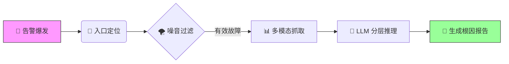

# AIOps-Intelligent-RCA v2.0: Neuro-Symbolic Triage Engine
An Agent-based Root Cause Analysis Framework with Counterfactual Verification.

> **Status:** Production-Ready | **Architecture:** Neuro-Symbolic (神经符号架构) | **Focus:** RPC Golden Signals
> 
> **⚠️ 声明**
> 
> 本仓库为项目架构与设计思想的展示。
> 鉴于商业保密协议 (NDA)，源代码及敏感脱敏数据未在此公开，仅保留文档以供技术交流。

## 📖 项目简介

这是一个面向微服务架构的**垂直领域智能诊断平台**。

针对大规模分布式系统中“告警风暴”与“故障定位难”的痛点，本项目摒弃了传统的规则匹配模式，构建了一套**“基于链路权重定位 + 贝叶斯统计去噪 + LLM 分层推理”**的自动化诊断管道。

系统能够自动屏蔽网络抖动噪点，精准锁定异常入口，并利用大模型（LLM）的多模态推理能力，实现从“故障发生”到“根因报告生成”的分钟级自动化闭环。

---

## 📚 文档导航

为了更清晰地展示系统设计，核心技术细节已拆分为以下独立文档：

### 🛠 系统设计与核心原理

* **[核心算法概念 (Core Concepts)](docs/design/CORE_CONCEPTS.md)**
    
    * 详解 **链路权重定位算法** 的权重因子设计。
    * 阐述 **贝叶斯网络** 在排除底层网络抖动中的数学原理。
    * 展示 **LLM 分层推理** 的 Prompt 结构与模拟案例。
* **[架构演进复盘 (Architecture Evolution)](docs/design/EVOLUTION.md)**
    
    * 记录系统从 v1.0 (规则引擎) 到 v2.0 (统计分析) 再到 v3.0 (生成式诊断) 的重构历程与技术决策。

### 💡 工程思考与博客

* **[大模型如何理解监控数据？](blog/llm_observability.md)** —— 探讨 Metrics-to-Text 的特征工程与上下文窗口优化。
* **[告警风暴下的“静默”艺术](blog/noise_reduction.md)** —— 关于分布式系统中级联故障识别的理论思考。

---

## ⚡ 核心处理流程

系统通过以下四步完成自动化诊断：

1. **定位 (Locate)**：基于加权传播算法，在错综复杂的调用链中锁定“故障源头应用”。
2. **去噪 (Filter)**：利用贝叶斯推论分析全网报错特征，自动排除专线抖动等非应用层故障。
3. **感知 (Sense)**：动态抓取 Metrics、Logs、K8s Events 及上下游变更记录。
4. **推理 (Reason)**：将多模态数据转化为自然语言上下文，驱动 LLM 进行因果推断。

---

## 💻 技术栈

* **核心语言**: Python (AsyncIO)
* **算法模型**: Bayesian Network, Isolation Forest, PageRank-like Algorithm
* **大模型基座**: GPT-5.1
* **数据源**: Prometheus, ELK, Clickhouse

---

## 📬 关于作者

热衷于 AIOps、LLM Agent 落地的后端工程师。
如果对本项目的设计细节或算法实现感兴趣，欢迎通过邮件或 Issue 进行技术交流。

* **Email**: qingshanyuluo@gmail.com
