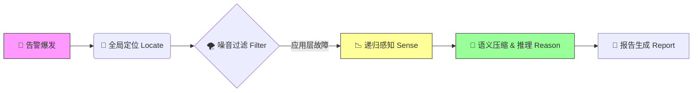

# AIOps-Intelligent-RCA v2.0: Neuro-Symbolic Triage Engine

> **Status:** Production-Ready | **Architecture:** Neuro-Symbolic (神经符号架构) | **Focus:** RPC Golden Signals
> 
> **⚠️ 声明**
> 
> 本仓库为项目架构与设计思想的展示。
> 鉴于商业保密协议 (NDA)，源代码及敏感脱敏数据未在此公开，仅保留文档以供技术交流。

## 📖 项目简介

这是一个面向微服务架构的**垂直领域智能诊断平台**。

针对大规模分布式系统中“告警风暴”与“故障定位难”的痛点，本项目构建了一套**“基于 Trace 拓扑定位 + 统计学特征提取 + LLM 分层反事实推理”**的自动化诊断管道。

系统采用**神经符号（Neuro-Symbolic）架构**：前端利用**Z-Score、日志聚类**等统计算法精准提取异常特征（符号化），后端利用 **LLM 进行因果推断与反事实验证**（神经连接），实现从“故障发生”到“根因报告生成”的分钟级自动化闭环。

---

## 📚 文档导航

为了更清晰地展示系统设计，核心技术细节已拆分为以下独立文档：

### 🛠 系统设计与核心原理

* **[核心算法概念 (Core Concepts)](docs/design/CORE_CONCEPTS.md)**
    
    * 详解 **链路权重定位算法** 的权重因子设计。
    * 阐述 **贝叶斯似然比** 在排除底层网络抖动中的数学原理。
    * 展示 **LLM 分层推理** 的 Prompt 结构与模拟案例。

* **[架构演进复盘 (Architecture Evolution)](docs/design/EVOLUTION.md)**
    
    * 记录系统从 v1.0 (反事实假设ReactAgent) 到 v2.0 (统计算法+固定SOP+LLM推论节点) 的重构历程与技术决策。

### 💡 工程思考与博客

* **[专线抖动异常检测算法](blog/专线抖动异常检测算法.md)** —— 探讨简单的应用错误率呈阶梯分布判断网络专线抖动为什么准
* **[幻觉与现实：从 ReAct 智能体到确定性工作流 —— 我在 AIOps 根因定位中的“祛魅”之旅](blog/幻觉与现实：从%20ReAct%20智能体到确定性工作流%20——%20我在%20AIOps%20根因定位中的“祛魅”之旅.md)** —— 关于我在做出完善ReAct模式Agent后为什么选择放弃
---

## ⚡ 核心处理流程

系统通过以下四步完成自动化诊断。与其他系统不同的是，我们在数据进入 LLM 之前进行了极高密度的**统计特征工程**与**递归深挖**。

### 1. 定位 (Locate)

* **Trace 聚合挖掘**：基于加权传播算法，在错综复杂的调用链中锁定真正的“故障源头”。
* **入口纠偏**：通过“阻力公式”区分显性报错与隐性慢，防止 Agent 被 N+1 或网络丢包误导。

### 2. 去噪 (Filter)

* **梯度故障定界**：基于错误率分布的梯度特征，自动区分“单点应用故障”与“底层网络/基础设施抖动”。

### 3. 感知 (Sense) —— *Recursive Statistical Extraction*

系统不直接将原始数据丢给 LLM，而是通过统计算法进行**特征提取**与**范围修正**，确保输入信噪比：

* **递归深挖 (Recursive Analysis)**：不仅仅关注报错节点，算法会自动递归扫描**高流量下游**及**自生耗时突增**的依赖服务。这能有效揪出那些“未报错但拖死上游”的隐性根因。
* **Metric 异常检测**：集成多种 **Z-Score 变体**（如 Robust Z-Score），动态扫描 CPU、Memory、IO 及 JVM 指标，精准识别偏离正态分布的突变点。
* **Log 聚类与背景抑制**：
    * 采用 **Drain/DBSCAN** 算法将海量日志聚类为核心模板（Template）。
    * **关键步骤**：引入“背景噪声过滤”机制，对比历史正常时段，自动剔除那些“日常就有、低影响”的无关报错，只保留故障期间**新增或频率激增**的异常日志。

### 4. 推理 (Reason) —— *Compression & Counterfactual Verification*

采用确定性的分层工作流（SOP），先“读薄”再“推断”：

* **语义压缩 (Information Compression)**：L1 节点并不直接推断根因，而是强制要求 LLM 将复杂的 Metrics 突变和 Log 聚类结果**翻译**为简练的自然语言摘要（Summary）。强制模型进行初步总结，同时不丢失原始信息
* **反事实验证 (Counterfactual Verification)**：在得出初步结论后，引入独立的 **Reviewer Agent** 进行自我驳斥。
    * *示例*：“Agent 假设根因是 GG 拖累。Reviewer 提出反事实：‘如果Gc问题，会所有节点一起有问题吗？会线程Dump中大量blocked吗’ —— 进而倒逼llm重新检索是否是下游变慢拖累上游”

---

## 💻 技术栈

* **核心语言**: Python (AsyncIO)
* **统计与算法**:
  * **Trace Mining**: Weighted Topology Propagation
  * **Anomaly Detection**: **Robust Z-Score**, 3-Sigma
  * **Log Mining**: **Drain3** / **DBSCAN** (Clustering & Noise Filtering)
* **大模型工程**:
  * **Framework**: LangChain (Custom Graph)
  * **Flow**: **SOP** (Summarize -> Reason -> Verify)
  * **Verification**: **Counterfactual Prompting**
* **数据源**: Prometheus, ELK, Clickhouse
---

## 📬 关于作者

热衷于 AIOps、LLM Agent 落地的后端工程师。
如果对本项目的设计细节或算法实现感兴趣，欢迎通过邮件或 Issue 进行技术交流。

* **Email**: qingshanyuluo@gmail.com
