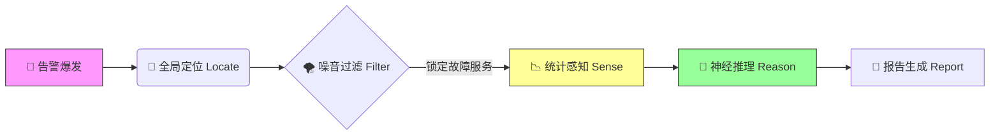

# AIOps-Intelligent-RCA v2.0: Neuro-Symbolic Triage Engine
An Agent-based Root Cause Analysis Framework with Counterfactual Verification.

> **Status:** Production-Ready | **Architecture:** Neuro-Symbolic (神经符号架构) | **Focus:** RPC Golden Signals
> 
> **⚠️ 声明**
> 
> 本仓库为项目架构与设计思想的展示。
> 鉴于商业保密协议 (NDA)，源代码及敏感脱敏数据未在此公开，仅保留文档以供技术交流。

## 📖 项目简介

这是一个面向微服务架构的**垂直领域智能诊断平台**。

针对大规模分布式系统中“告警风暴”与“故障定位难”的痛点，本项目构建了一套**“基于 Trace 拓扑定位 + 统计学特征提取 + LLM 分层反事实推理”**的自动化诊断管道。

系统采用**神经符号（Neuro-Symbolic）架构**：前端利用**Z-Score、日志聚类**等统计算法精准提取异常特征（符号化），后端利用 **LLM 进行因果推断与反事实验证**（神经连接），实现从“故障发生”到“根因报告生成”的分钟级自动化闭环。

---

## 📚 文档导航

为了更清晰地展示系统设计，核心技术细节已拆分为以下独立文档：

### 🛠 系统设计与核心原理

* **[核心算法概念 (Core Concepts)](docs/design/CORE_CONCEPTS.md)**
    
    * 详解 **链路权重定位算法** 的权重因子设计。
    * 阐述 **贝叶斯似然比** 在排除底层网络抖动中的数学原理。
    * 展示 **LLM 分层推理** 的 Prompt 结构与模拟案例。

* **[架构演进复盘 (Architecture Evolution)](docs/design/EVOLUTION.md)**
    
    * 记录系统从 v1.0 (反事实假设ReactAgent) 到 v2.0 (统计算法+固定SOP+LLM推论节点) 的重构历程与技术决策。

### 💡 工程思考与博客

* **[专线抖动异常检测算法](blog/专线抖动异常检测算法.md)** —— 探讨简单的应用错误率呈阶梯分布判断网络专线抖动为什么准
* **[幻觉与现实：从 ReAct 智能体到确定性工作流 —— 我在 AIOps 根因定位中的“祛魅”之旅](blog/幻觉与现实：从%20ReAct%20智能体到确定性工作流%20——%20我在%20AIOps%20根因定位中的“祛魅”之旅.md)** —— 关于我在做出完善ReAct模式Agent后为什么选择放弃
---

## ⚡ 核心处理流程

系统通过 **“全局定位 -> 局部感知 -> 逻辑推理”** 三阶段完成诊断：

### Phase 1: 定位与定界 (Locate & Filter)

* **Trace 聚合挖掘**：基于加权传播算法，在错综复杂的调用链中锁定真正的“故障源头”而非受害者。
* **梯度故障定界**：基于错误率分布的梯度特征，自动区分“单点应用故障”与“底层网络抖动”。

### Phase 2: 多模态感知 (Sense) —— *Statistical Feature Extraction*

一旦锁定目标服务，系统不直接将原始数据丢给 LLM，而是通过统计算法进行**特征工程**：

1. **Metric 异常检测**：使用 **Z-Score (标准分数)** 算法扫描 CPU、Memory、IO 及 JVM 指标，识别偏离正态分布的突变点。
2. **Log 语义压缩**：采用 **Drain/DBSCAN** 算法对海量错误日志进行聚类，提取核心报错模板（Template），将百万行日志压缩为几条关键特征描述。

### Phase 3: 神经符号推理 (Reason) —— *LLM Reasoning & Verification*

将上述“符号化”的特征组装成 Prompt，驱动 LLM 执行**分层推理**：

1. **SOP 分层诊断**：遵循 `现象确认 -> 异常关联 -> 根因推断` 的思维链（Chain of Thought），避免模型发散。
2. **反事实验证 (Counterfactual Verification)**：LLM 自主提出假设（“如果排除 GC 问题，错误是否依然存在？”），并通过检索上下游证据进行自我驳斥或确认，大幅降低幻觉率。

---

## 💻 技术栈

* **核心语言**: Python (AsyncIO)
* **算法模型**: Bayesian Network, Isolation Forest, PageRank-like Algorithm
* **大模型基座**: GPT-5.1
* **数据源**: Prometheus, ELK, Clickhouse

---

## 📬 关于作者

热衷于 AIOps、LLM Agent 落地的后端工程师。
如果对本项目的设计细节或算法实现感兴趣，欢迎通过邮件或 Issue 进行技术交流。

* **Email**: qingshanyuluo@gmail.com
