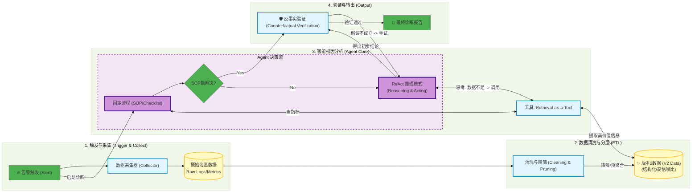

# AIOps-Intelligent-RCA
An Agent-based Root Cause Analysis Framework with Counterfactual Verification.

## 📖 Introduction (项目简介)

**AIOps-Intelligent-RCA** 是一个面向大规模微服务架构的智能根因分析 (RCA) 框架。针对传统运维中告警风暴和专家经验难以沉淀的痛点，本项目提出了一种 **Agent-Driven (智能体驱动)** 的诊断模式。

通过 **Retrieval-as-a-Tool** 机制，Agent 能够自主查询 Metrics、Logs、Traces 和 Events，并引入 **Counterfactual Verification (反事实验证)** 机制，有效解决了 LLM 在运维领域的幻觉问题。

## 🚀 Key Features (核心特性)

* **🕵️‍♂️ Agentic Diagnosis:** 基于 LLM 的推理核心，动态编排排查步骤，而非死板的规则树。
* **📉 Multi-modal Fusion:** 融合 RPC 错误率、Z-score 异常检测、拓扑链路分析、Change Events 等多维数据。
* **🛡️ Counterfactual Verification:** **(创新点)** 系统在得出结论前，会自动生成反事实假设（"如果是网络问题，TCP重传率应升高"）并进行自我验证，大幅提升准确率。
* **🔍 Automatic Topology Drill-down:** 自动识别 Trace 中的最深报错节点与慢节点。

## 🏗️ Architecture (系统架构)

### Workflow
1.  **Alert Trigger:** RPC 错误率突增触发诊断。
2.  **Data Aggregation:** 自动聚合 1h 内的 Logs 和 Metrics。
3.  **Root Cause Reasoning:** Agent 通过剪枝及统计学算法等方式识别可疑应用后通过Retrieval-as-a-Tool获取数据，推测根因
4.  **Verification:** 执行反事实推理，验证假设。
5.  **Report:** 生成包含根本原因和建议的报告。

## 💻 Core Logic (核心逻辑摘要)

### 1. Retrieval-as-a-Tool
Agent 并不直接“看”所有数据，而是通过 Tool 调用获取数据，模拟专家排查过程：

### 2. Counterfactual Verification (反事实验证)
这是本框架防止幻觉的核心机制：

Hypothesis: "Redis 响应慢导致上游 RPC 超时" Counterfactual Check: 查询 Redis 实例过去 10 分钟的 P99 延迟。 Result: 如果 P99 < 10ms，则推翻假设，Agent 重新规划排查路径。

## 📂 Case Study (案例分析)

> [TODO: Case Study]

📝 Citation & Contact
如果您对该架构感兴趣，欢迎在 Issues 中讨论。

Disclaimer: This repository contains the architectural design and reference implementation patterns. Proprietary business logic has been obfuscated.
