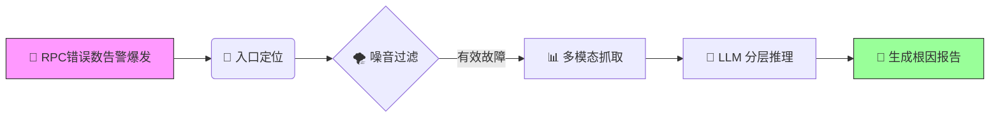

# AIOps-Intelligent-RCA v2.0: Neuro-Symbolic Triage Engine
An Agent-based Root Cause Analysis Framework with Counterfactual Verification.

> **Status:** Production-Ready | **Architecture:** Neuro-Symbolic (神经符号架构) | **Focus:** RPC Golden Signals
> 
> **⚠️ 声明**
> 
> 本仓库为项目架构与设计思想的展示。
> 鉴于商业保密协议 (NDA)，源代码及敏感脱敏数据未在此公开，仅保留文档以供技术交流。

## 📖 项目简介

这是一个面向微服务架构的**垂直领域智能诊断平台**。

针对大规模分布式系统中“告警风暴”与“故障定位难”的痛点，本项目摒弃了传统的“规则匹配”或单纯的“最深报错节点”逻辑，构建了一套**“基于 Trace 聚合挖掘的入口纠偏 + 错误率梯度定界 + LLM 分层推理”**的自动化诊断管道。

系统通过**内存图折叠技术**自动修正“受害者误报”，利用**统计物理学原理**屏蔽网络抖动，并利用大模型（LLM）的多模态推理能力，实现从“故障发生”到“根因报告生成”的分钟级自动化闭环。

---

## 📚 文档导航

为了更清晰地展示系统设计，核心技术细节已拆分为以下独立文档：

### 🛠 系统设计与核心原理

* **[核心算法概念 (Core Concepts)](docs/design/CORE_CONCEPTS.md)**
    
    * 详解 **链路权重定位算法** 的权重因子设计。
    * 阐述 **贝叶斯似然比** 在排除底层网络抖动中的数学原理。
    * 展示 **LLM 分层推理** 的 Prompt 结构与模拟案例。

* **[架构演进复盘 (Architecture Evolution)](docs/design/EVOLUTION.md)**
    
    * 记录系统从 v1.0 (反事实假设ReactAgent) 到 v2.0 (统计算法+固定SOP+LLM推论节点) 的重构历程与技术决策。

### 💡 工程思考与博客

* **[专线抖动异常检测算法](blog/专线抖动异常检测算法.md)** —— 探讨简单的应用错误率呈阶梯分布判断网络专线抖动为什么准
* **[幻觉与现实：从 ReAct 智能体到确定性工作流 —— 我在 AIOps 根因定位中的“祛魅”之旅](blog/幻觉与现实：从%20ReAct%20智能体到确定性工作流%20——%20我在%20AIOps%20根因定位中的“祛魅”之旅.md)** —— 关于我在做出完善ReAct模式Agent后为什么选择放弃
---

## ⚡ 核心处理流程

系统通过以下四步完成自动化诊断：

1. **定位 (Locate)**：基于加权传播算法，在错综复杂的调用链中锁定“故障源头应用”。
2. **去噪 (Filter)**：基于“错误率梯度”的故障定界 (Error Rate Gradient Localization)
3. **感知 (Sense)**：动态抓取 Metrics、Logs、K8s Events 及上下游变更记录。
4. **推理 (Reason)**：将多模态数据转化为自然语言上下文，驱动 LLM 进行因果推断。

---

## 💻 技术栈

* **核心语言**: Python (AsyncIO)
* **算法模型**: Bayesian Network, Isolation Forest, PageRank-like Algorithm
* **大模型基座**: GPT-5.1
* **数据源**: Prometheus, ELK, Clickhouse

---

## 📬 关于作者

热衷于 AIOps、LLM Agent 落地的后端工程师。
如果对本项目的设计细节或算法实现感兴趣，欢迎通过邮件或 Issue 进行技术交流。

* **Email**: qingshanyuluo@gmail.com
